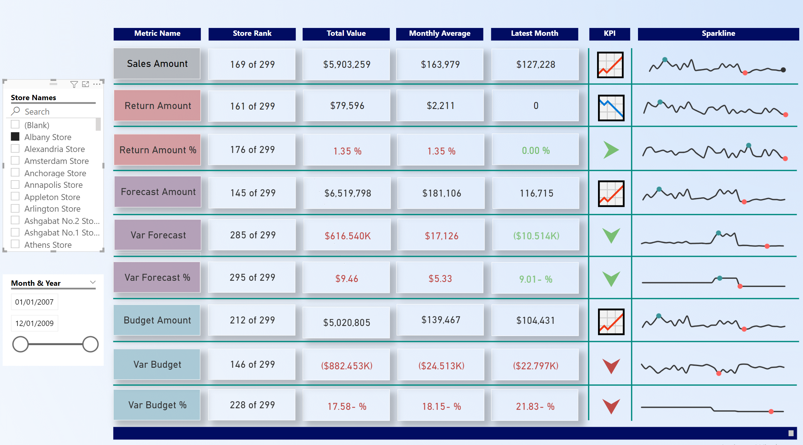

# طراحی داشبورد کارت امتیازی فروشگاه زنجیره‌ای - Power BI Project

##  معرفی پروژه

این پروژه با هدف طراحی یک **کارت امتیازی عملکرد (Performance Scorecard)** برای یک فروشگاه زنجیره‌ای که نمایندگی‌های گوناگونی در دنیا دارد به کمک دوره PowerBI Advanced در سایت کوِئرا انجام شده است. در این کارت امتیازی، مجموعه‌ای از شاخص‌های کلیدی عملکرد (KPIs) جهت ارزیابی عملکرد فروشگاه‌ها در ابعاد مختلف طراحی و در قالب یک داشبورد تعاملی در Power BI پیاده‌سازی شده‌اند.

> توجه: این کارت امتیازی از نوع *Balanced Scorecard* نیست، اما از رویکرد ساختاریافته در تعریف و نمایش معیارها استفاده شده است.

---

##  اهداف پروژه

- تحلیل عملکرد فروشگاه‌ها از جنبه‌های مختلف مانند فروش، موجودی، رضایت مشتری و بهره‌وری فروش و ..  
- طراحی یک داشبورد تعاملی برای تصمیم‌گیری سریع مدیران  
- نمایش وضعیت هر شاخص به صورت دیداری (نشانگرها، رنگ‌ها، نمودارها و ...)  

---

##  متریک‌های کلیدی طراحی شده

برخی از متریک‌های کلیدی در این کارت امتیازی عبارتند از:

- مجموع فروش ماهانه / سالانه  
- درصد رشد نسبت به دوره قبل  
- مقدار و نرخ بازگشت(مرجوعی) کالاها
- پیشبینی مقدار فروش برای فروشگاه‌ها   
- مقادیر بودجه   

---

##  ابزارها و تکنولوژی‌ها

- **Power BI Desktop** برای طراحی داشبورد  
- **Microsoft Excel / CSV** به عنوان منبع داده  
- **DAX (Data Analysis Expressions)** برای تعریف معیارهای محاسباتی  
- طراحی بصری با استفاده از کارت‌ها، نمودارها، فیلترها و شاخص‌های رنگی

---
## پیش‌نمایش 

##  نکات تکمیلی
طراحی داشبورد به صورت کاربرپسند و قابل استفاده برای مدیران غیرتحلیلی انجام شده است.

تمامی معیارها قابل فیلتر و مقایسه بین بازه‌های زمانی هستند.

ساختار داده‌ای با مدل ستاره‌ای ساده‌سازی شده و از روابط میان جداول استفاده شده است.
---

##  اجرای پروژه
برای مشاهده داشبورد:

فایل dashboard.pbix را با نرم‌افزار Power BI Desktop باز کنید.
---

##  ارتباط با من
در صورت داشتن هرگونه سؤال یا پیشنهاد:

ایمیل: sa33d.mirich@gmail.com
---
